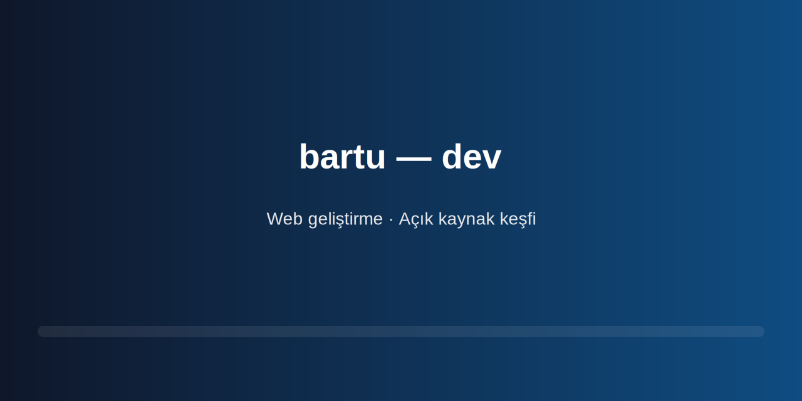

# bartu — dev 🚀

Merhaba! 19 yaşındayım, Bilgisayar Programcılığı 1. sınıf öğrencisiyim. Web geliştirmeye meraklıyım; açık kaynak projelerini keşfetmeyi ve onlara katkıda bulunmayı çok seviyorum. 👋

## Yetenekler 🧰

- **Web (🌐):** HTML · CSS · JavaScript · React · Responsive tasarım
- **Veri & DB (🗄️):** Temel SQL · SQLite · Veri işleme fikirleri
- **Araçlar (🛠️):** Git · GitHub · VS Code
- **Kaynak keşfi (🔎):** Açık kaynak projeleri inceleme ve katkı araştırması

## İletişim ✉️

- **E‑posta:** ✉️ bartuyildiz02@gmail.com
- **LinkedIn:** 💼 https://www.linkedin.com/in/bartuy%C4%B1ld%C4%B1z/
- **X:** 🐦 https://x.com/02bartwo

## Eğitim 🎓

- University of Kyrenia — Bilgisayar Programcılığı, 1. sınıf

## İlgi Alanları ⭐

- Web geliştirme · Açık kaynak
